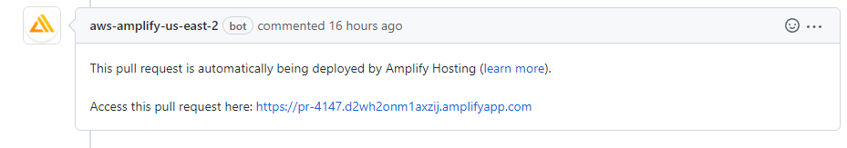
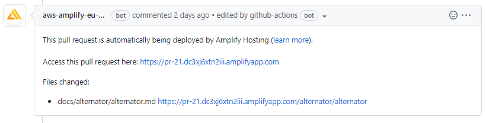

# Amplify enhanced action

GitHub Action extension that powers up AWS Amplify with preview links for every change edited.

## Motivation

Amplify publishes a message for every pull request with a link to the preview site:



This allows reviewers to preview how the changes will look like in the documentation site. However, they have to surf the site to find the specific documentation page(s) that have received an update.

When using the Amplify enhanced action, the message generates a preview URL for every file changed:



## Installation

Sample workflow `.github/workflows/docs-amplify-enhanced.yml`

```
name: "Docs / Amplify enhanced"

on: issue_comment

jobs:
  build:
    runs-on: ubuntu-latest
    if: ${{ github.event.issue.pull_request }}
    steps:
      - name: Checkout
        uses: actions/checkout@v3
        with:
          fetch-depth: 0
      - name: Amplify enhanced
        env:
          TOKEN: ${{ secrets.GITHUB_TOKEN }}
        uses: scylladb/sphinx-scylladb-theme/.github/actions/amplify-enhanced@master
```

## How it works

A workflow triggers the Amplify enhanced action when AWS publishes the preview message on the pull request. Then, Amplify enhanced action:

1. Reads the AWS Amplify message and parses the preview URL.
2. Detects which Markdown and restructuredText files within the docs folder received an update.
3. Computes the preview URLs for each documentation file.
4. Edits the original AWS Amplify message with the preview URLs for each documentation page.

**Exception**

Amplify enhanced action deletes the Amplify preview message if no documentation files are changed.

## Sponsors

This project is sponsored by ScyllaDB, The Real-Time Big Data Database.

## License

Copyright (c) 2022 - present David Garcia (@dgarcia360).

Licensed under the MIT License.
