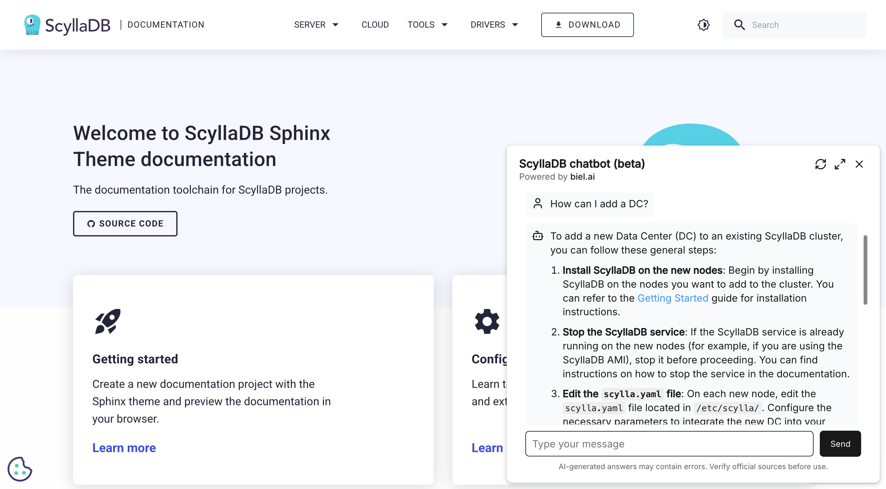

=========================
AI chatbot support (beta)
=========================

ScyllaDB Docs integrates with `Biel.ai <https://biel.ai/>`_ to offer a conversational interface for documentation.

The chatbot can answer documentation-related questions and provide relevant links to help users find the information they need quickly.

.. note::
    This feature is in beta and disabled by default. It will be gradually enabled for all documentation sites in a future release.
    If you want to enable it now, please contact us in Slack (``#scylla-docs`` channel).

Installation
------------

To enable the AI chatbot, update your ``conf.py`` file by setting ``hide_ai_chatbot`` to ``false`` in ``html_theme_options``:

.. code-block:: python

    html_theme_options = {
        "hide_ai_chatbot": "false"
    }

Usage
-----

Once enabled, the Ask AI button will appear in the documentation interface.
Users can click the button to start a conversation, ask questions, and receive responses with relevant documentation links.

Configuration options
---------------------

.. list-table::
  :widths: 20 20 20 40
  :header-rows: 1

  * - Option
    - Type
    - Default Value
    - Description
  * - ``hide_ai_chatbot``
    - string
    - true
    - Hides the AI chatbot button in the documentation.
  * - ``ai_chatbot_id``
    - string
    - ddfdo8m94k
    - Biel.ai project ID.

Troubleshooting
---------------

If the chatbot does not appear:

* Ensure ``hide_ai_chatbot`` is set to false in html_theme_options.

* Verify that ai_chatbot_id is correctly set to a valid Biel.ai project ID.

* Check for errors in the browser console that may indicate issues with the integration.

For more details, refer to the `Biel.ai documentation <https://docs.biel.ai/>`_.
