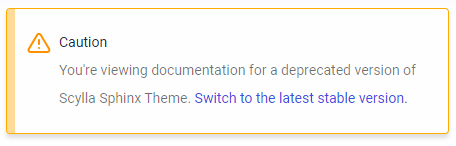

====================
Multiversion options
====================

The toolchain adds by default the extension `sphinx-multiversion <https://github.com/dgarcia360/sphinx-multiversion>`_ for building self-hosted versioned documentation.

On this page, you will learn:

- How to list new versions.
- How to define a stable url.
- How to disable multiversion support.

Listing new versions
--------------------

.. caution:: Maintaining multiple versions is expensive. Consider listing docs for new versions only if the release introduces relevant breaking changes reflected in the documentation.
    For example, it's preferable to build docs for a major release rather than one release per patch.

The settings ``TAGS`` and ``BRANCHES`` in ``conf.py`` defines which versions are supported:

* ``BRANCHES``:  List of `git branches <https://git-scm.com/book/en/v2/Git-Branching-Basic-Branching-and-Merging>`_, separated by a comma. For example, ``BRANCHES= ['master']`` builds docs for the ``master`` branch.
* ``TAGS``:  List of `git tags <https://git-scm.com/book/en/v2/Git-Basics-Tagging>`_, separated by a comma. For example, ``TAGS = ['3.22.0', '3.21.0']`` builds docs for the tags ``3.22.0`` and ``3.21.0``.

.. tip:: If you maintain a branch for each minor release (e.g. ``branch-3.22``), we recommended building docs for the **branch** and not for tags. This will allow you to backport documentation changes if needed without having to update the tag reference.

The setting ``LATEST_VERSION`` in ``conf.py`` defines which branch or tag is considered the latest.
This is used to redirect users to the latest version of the docs automatically once they open the main project URL.

For example, if you want to build docs for the tags ``3.22.0`` and ``3.21.0``, ``master`` branch, the configuration file ``conf.py`` should look like this:

.. code:: python

    TAGS = ['3.22.0', '3.21.0']
    BRANCHES = ['master']
    LATEST_VERSION = '3.22.0'

The extension allows configuring additional settings.
To know more about them, refer to `sphinx-multiversion documentation <https://holzhaus.github.io/sphinx-multiversion/master/configuration.html>`_.

Defining a stable URL
---------------------

We encourage every project to rename the latest version output directory to ``stable``.
The purpose is to have default documentation links that do not change, which is beneficial for SEO purposes and referencing docs on other websites.

You can override the latest version output directory via the configuration file ``conf.py`` with the setting ``smv_rename_latest_version``:

.. code:: python

    smv_latest_version = LATEST_VERSION  # Use the branch/tag name
    smv_rename_latest_version = 'stable' # Use the commit hash

Defining unstable versions
--------------------------

Suppose you want to build docs for a version of the software you have not released yet (e.g. ``master``).
In this case, you can mark the version as unstable in the ``conf.py`` file.

.. code:: python

    BRANCHES = ['master']
    UNSTABLE_VERSIONS = ['master']

 By doing so, the warning message that appears at the top of the page will change to:

.. image:: images/unstable.png

Defining deprecated versions
----------------------------

Suppose you want to build docs for a version of the software you don't support anymore.
In this case, you can mark the version as deprecated in the ``conf.py`` file.

.. code:: python

    TAGS = ['3.2.0']
    DEPRECATED_VERSIONS = ['3.2.0']

By doing so, the warning message that appears at the top of the page will change to:

Disabling multiversion support
------------------------------

#. Set the settings ``smv_tag_whitelist`` and ``smv_branch_whitelist`` in ``conf.py`` to ``None``.

    .. code:: python

        smv_tag_whitelist = None
        smv_branch_whitelist = None

    or:

    .. code:: python

        TAGS = []
        smv_tag_whitelist = multiversion_regex_builder(TAGS)
        BRANCHES = []
        smv_branch_whitelist = multiversion_regex_builder(BRANCHES)

#. On ``.github/workflows/pages.yml``, change the command ``make multiversion`` for ``make dirhtml``.
