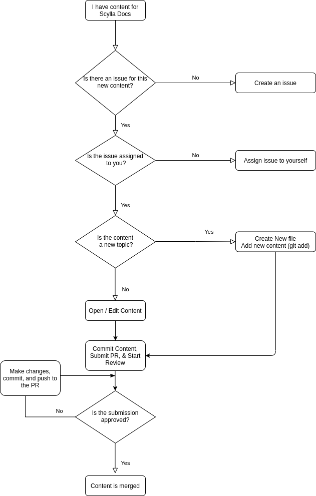

===================================
Scylla docs contributor’s handbook
===================================

.. contents::
   :depth: 2
   :local:

Introduction
------------
If you are reading this guide because you have decided to contribute to Scylla Documentation, thank you!
We appreciate your contribution and hope that this handbook will answer any questions you may have.

The purpose of this handbook is to explain how to contribute new content to Scylla Docs either as a new topic or by editing an existing topic.

If you feel something is missing from this document, do not hesitate to let us know. You can use the Feedback button at the bottom to open an issue.

About Scylla Docs
-----------------

Scylla Docs contains all of the user documentation for installing, maintaining, administering, and developing applications for the Scylla Database.
Each project in the ScyllaDB organization is hosted on GitHub.
For most of the projects, there is a dedicated ``docs`` folder where all of the documentation for that project is stored.
All projects have a file called ``README``. Consult the README file for more specific information on any individual project.

How we write
============

Documentation is written primarily for developers and database administrators.
All documentation is saved and tracked on GitHub.
We have created a Style Guide that breaks down the writing rules.
Our documentation has an optional Vale linter which can be used to check that your writing conforms to the Scylla Style.

Languages/toolchain we use
==========================

The backbone of the docs is written in reStructuredText and the Documentation is compiled with Sphinx.
Some of our upstream content is written in Markdown and Sphinx also supports Markdown as well.

You will find templates and cheatsheet links later in this document.
You can use them to make sure your document is organized and tagged correctly.

We use the following tools for the following purposes:

.. list-table::
   :widths: 30 70
   :header-rows: 1

   * - Tool
     - Purpose
   * - `Sphinx <https://www.sphinx-doc.org/en/master/usage/restructuredtext/index.html>`_
     - Used to compile the HTML pages. This tool converts .rst and .md to .html.
       It also has directives and extensions to add more style and options for formatting the text.
       The CSS for the project is a sphinx theme. Our theme is not open-sourced.
   * - `Vale <https://github.com/apps/vale-linter>`_
     - Used as a linter to check for issues with style, spelling, and grammar.
   * - GitHub
     - Hosts all our code and docs
   * - GitHub Pages
     - Static site generator for the docs.
   * - GitHub Actions
     - Builds and deploys the documentation to GitHub Pages every time there is new content. All the repositories deploy the documentation automatically except the repository scylla-docs, which is deployed manually.
   * - Markdown
     - Content written upstream is often written in Markdown. You can use Markdown to create content pages as an alternative to restructuredText.
   * - restructuredText
     - Most of our content is written in restructuredText. restructuredText is a Markdown-like language which can be converted to HTML with Sphinx.

About Issues and Pull Requests
-------------------------------

Any documentation contribution, no matter how small, is made as a pull request (PR) on GitHub. You can use a client, the Web UI, or the command line to manage your PRs.

Workflow for Submissions
------------------------
As all content is submitted as a pull request the following diagram can be used to represent the workflow.

Issue assignment
================

Each repository has an issues page on GitHub.
Doc issues are generally labeled with a documentation or docs label.
Although assignment specifics may change from project to project, please do not work on issues that are not assigned to you.
This avoids working on something someone else is working on.
Also, if there is an issue with any guide and the issue does not exist, please create an issue so it can be tracked.

Guidelines for branch names
===========================

Ask the Maintainer of the project if he/she has any preference for naming branches before you contribute to the repo to avoid any collisions or confusion.
If you are providing both documentation and code, it is recommended to name all of your documentation branches with a doc- prefix.

Write content
=============

When writing content for Scylla, we use an informal topic-based writing approach.
There are three kinds of topics:

* Informational --- Gives an overview of the subject
* Procedural --- Gives instructions on how to use the subject
* Referential --- Gives additional information about the particular topic
* All content must be written in US English. Use as few words as possible and try to keep the reading level to under grade 8. You can use word counters and readability tests to keep the reading level down.

Write procedures
................

Each procedure should have an introductory paragraph (1-3 sentences) which explains what the procedure does, when you should use it, and what benefit the procedure provides.
After the introduction, there should be a numbered list of steps. Use the following guidelines to write the steps:

* Each step should be one single action.
* Steps should be written in clear, simple vocabulary that is easy to follow. If the step includes a code snippet, a screenshot of the expected outcome should follow.
* If the procedure includes changing a configuration, the next step should include how to verify that the configuration change was successful.
* Wherever possible, instructions on how to reverse the action should also be included (not part of the original procedure, but included in a separate procedure.

Scylla Style guide
..................

The Scylla Style guide is being developed. You can view the document here. The style guide outlines the way we write documentation. In short, use this handbook, the style guide, and the templates to write content.
Documentation templates and cheat sheets
In the Scylla-docs project we will store templates which can be used in every Scylla Project.

Templates
.........

Use these templates to create new content. There are templates in .rst and .md for the following documents:

* KB Articles
* General Topics
* Known Issues / Troubleshooting
* Procedures (How To)

Cheatsheets
...........

If you want to use a cheat sheet for Markdown or restructuredText, here are some which are helpful:

* :doc:`Scylla Cheat Sheet <../examples/index>` - samples of |rst| markup.
* `restructuredText Cheat Sheet <https://github.com/ralsina/rst-cheatsheet/blob/master/rst-cheatsheet.rst>`_
* `GitHub Markdown Cheat Sheet <https://github.com/adam-p/markdown-here/wiki/Markdown-Cheatsheet>`_

Add new content to the TOC tree
===============================

When adding new content to any repo you must add the topic to the `toc tree <https://www.sphinx-doc.org/en/master/markup/toctree.html>`_. If you do not you will have an error when compiling.

**Procedure**

#. Look in the folder in which the topic is located and find the index.rst / index.md file which is inside the same directory as the topic.
#. Edit the toctree directive to include the name of the new topic without its extension
#. Save the file
#. Make a preview and make sure there are no errors.

Best practices for content submission
=====================================

* Always open an issue describing what you want to work on if one doesn't already exist.
* Use GitHub search to see if there is someone else working on the issue already. Look at the open PRs.
* Test the new / changed content using the make preview script. Confirm there are no compilation errors before submitting.
* Give some text to your commit message. Explain why you did what you did. If you changed something in formatting, provide a before and after screenshot.

Test the new/changed content
============================
Included in every existing documentation project is a make file.
This file contains scripts that you can run to create a testing environment, compile the docs, and produce a local sandbox (website) to test the rendering of the HTML documentation.

When you run a preview it creates a local website for the docs project you’re running.

**Procedure**

#. From a terminal, change the directory to the /docs directory.
#. Run ``make preview`` command.
#. Confirm the script completes successfully.
#. From a browser navigate to http://127.0.0.1:5500/ to view the content. If you are generating multiple versions, navigate to  http://0.0.0.0:5500/. Confirm that the content renders properly, the links work, and you are happy with the results.

Additional Scripts
From the Make file (located in most projects in the /docs/makefile directory), there are several scripts you can run:

.. list-table::
   :widths: 33 33 33
   :header-rows: 1

   * - Command
     - Description
     - When to use
   * - ``make preview``
     - The preview command builds a local instance of the docs site so you can view the rendering in a sandbox environment on your local browser.
       The build contains only a single version even if the docs are enabled for more.
       This command can keep running while you’re working and will refresh the content accordingly.
     - Each time you want to create a copy of the Scylla Docs site. If you are sending a PR you must run this command with no errors before submitting the PR.  Note that if you make changes to the index or TOC while this command is running the changes may not be implemented and you will have to stop this command and run a make clean and then rerun the make preview.
   * - ``make clean``
     - The make preview operation creates content in the _build directory. When making changes to the docs, it is helpful to delete the contents of this directory before running make preview.
     - * Run before make preview (first time).
       * Run if you have changed the toc or index pages.
   * - ``make pristine``
     - Provides a deeper clean of the temporary files. This script resets all the custom changes done in the repository that are not committed.
     - This command should be used in cases where the make clean command does not work effectively.
   * - ``make dirhtml``
     - Creates an HTML version which you can view using a file explorer. This command  generates HTML docs under the docs/_build/dirhtml directory.
     - Mainly used by CI scripts.
   * - ``make linkcheck``
     - Runs a check on all links in the entire site and confirms that they do not result in a 404
     - When you make structural changes to the docs, especially when you delete pages.
   * - ``make multiversion``
     - If there is more than one version of the documentation defined, this script will create a multiversion output.
     - Mainly used by CI scripts.
   * - ``make multiversionpreview``
     - Allows you to view multiple versions of the docs as defined in the multiversion configuration settings.
     - When you want to preview how the documentation will be published when multiple versions are defined.

Submit a pull request (PR)
==========================

We expect that you are aware of how to submit a PR to GitHub. If you are not, please look at this `tutorial <https://guides.github.com/activities/hello-world/>`_.
Every repository handles PRs differently. Some require you to use a template for submissions and some do not.
Make sure to speak with the project’s maintainer before submitting the PR to avoid any misunderstanding or issues.

If you are writing new content it is **highly recommended** to set your PR to a draft state.
For Documentation PRs, the following guidelines should be applicable to all Scylla projects:

* Use the Vale Linter before submitting your PR to make sure your submission is free of any mechanical or grammatical errors.
* Test the instructions against the product. For all tests you must use a clean, new install unless otherwise specified in the issue.
* Make sure the PR renders with no errors and that make preview does not return any errors.
* Cite the issue you are fixing in the PR comments and use screenshots to show changes in formatting.
* In the subject line of the PR prepend the subject with ``Docs:``.

If you have any questions about the process, ask the maintainer of the project you're working on.

Scylla-docs Slack Channel
-------------------------

The `Scylla Users Slack <http://slack.scylladb.com/>`_ has a scylla-docs channel. There you will find the docs team and other enthusiasts about docs.
This channel is public.

Resources
----------

The following resources can be used to help you create content for Scylla:

How to contribute to `Scylla code <https://scylla.docs.scylladb.com/master/contribute/index.html>`_
