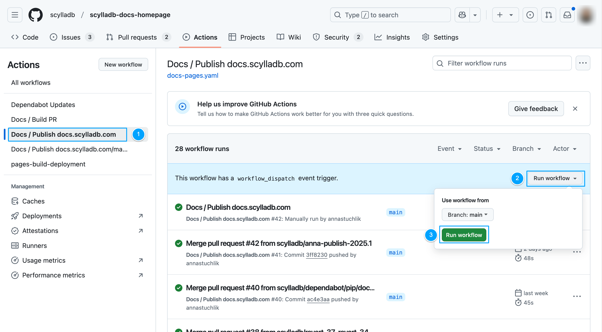

=======================
Centralized publication
=======================

Certain core ScyllaDB projects are configured or published from the repository `scylladb/scylladb-docs-homepage <https://github.com/scylladb/scylladb-docs-homepage>`_
instead of the project repository itself.

This allows us to:

* Publish core set of docs from a common domain: ``https://docs.scylladb.com/<PROJECT_NAME>/`` instead of ``https://<PROJECT_NAME>.docs.scylladb.com``.
* Manage release configuration externally, from a single place, without having to update each project repository.

Projects published from scylladb-docs-homepage
----------------------------------------------

The following projects are published from the ``scylladb-docs-homepage`` repository to the ``docs.scylladb.com`` domain:

* `ScyllaDB Homepage <https://docs.scylladb.com/>`_: Published every time there is a new commit on the ``main`` branch.
* `ScyllaDB Manual <https://docs.scylladb.com/manual/>`_: Published every 24 hours or whenever the file `manual_doc_versions.json <https://github.com/scylladb/scylladb-docs-homepage/blob/main/docs/_static/data/manual_doc_versions.json>`_ receives an update.

Projects defining versions in scylladb-docs-homepage
----------------------------------------------------

The following projects define their versions in the ``scylladb-docs-homepage`` repository:

* ScyllaDB Homepage: `conf.py <https://github.com/scylladb/scylladb-docs-homepage/blob/main/docs/conf.py>`_
* ScyllaDB Manual: `manual_doc_versions.json <https://github.com/scylladb/scylladb-docs-homepage/blob/main/docs/_static/data/manual_doc_versions.json>`_
* ScyllaDB Open Source: `opensource_doc_versions.json <https://github.com/scylladb/scylladb-docs-homepage/blob/main/docs/_static/data/opensource_doc_versions.json>`_
* ScyllaDB Enterprise: `enterprise_doc_versions.json <https://github.com/scylladb/scylladb-docs-homepage/blob/main/docs/_static/data/opensource_doc_versions.json>`_

.. note:: ScyllaDB Open Source and Enterprise multiversion configuration is defined in scylladb-docs-homepage, but the publication process happens in the respective project repositories.

List a new version
------------------

To add a new release to the centralized publication, submit a pull request to the `scylladb/scylladb-docs-homepage <https://github.com/scylladb/scylladb-docs-homepage>`_ repository with the following changes:

1. Open the `docs/_static/data/ <https://github.com/scylladb/scylladb-docs-homepage/tree/main/docs/_static/data>`_ directory.
2. Update the `<PROJECT_NAME>_doc_versions.json` file. Add the new version to the ``branches`` array:

    .. code-block:: json
       :emphasize-lines: 6

        {
            "tags": [],
            "branches": [
                "master",
                "branch-2025.1",
                "branch-2025.2"
            ],
            "latest": "branch-2025.1",
            "unstable": ["master"],
            "deprecated": []
        }

    .. note:: The branch should already exist in the associated project repository.

3. In the same file, set the new version as the ``latest``:

    .. code-block:: json
       :emphasize-lines: 8

        {
            "tags": [],
            "branches": [
                "master",
                "branch-2025.1",
                "branch-2025.2"
            ],
            "latest": "branch-2025.2",
            "unstable": ["master"],
            "deprecated": []
        }

4. Submit your changes in a pull request and get it approved.

5. Once merged, the new version will be published.

    .. note:: For open-source and enterprise projects, publication will trigger automatically the next time the associated repository receives an update. This is because scylladb-docs-homepage only defines the versions, not the publication scripts.

Trigger a manual publication
-----------------------------------

If you need to publish a new version immediately on the projects:

* ScyllaDB Homepage
* ScyllaDB Manual

You can trigger a manual publication by following these steps:

1. Go to the `Actions <https://github.com/scylladb/scylladb-docs-homepage/actions/>`_ tab in the `scylladb-docs-homepage` repository.
2. Find the workflow you want to run: `Docs / Publish docs.scylladb.com` or `Docs / Publish docs.scylladb.com/manual`.
3. Click on the workflow name to open the workflow details.
4. Click the **Run workflow** button.
5. In the **Branch** field, keep ``main``.
6. Click the green **Run workflow** button.

For more details, see `Manually running a workflow <https://docs.github.com/actions/managing-workflow-runs-and-deployments/managing-workflow-runs/manually-running-a-workflow>`_.
