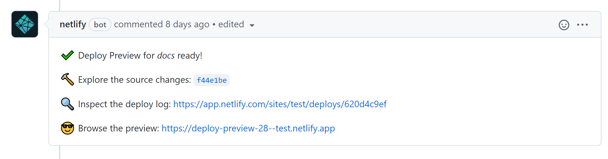

Pull requests previews
======================

.. warning:: This feature is under beta testing and only available for a selected number of projects.

We use Netlify CI to build a preview site for the docs every time someone sends a pull request that updates the docs folder.

Once the build completes, the pull request receives a message with a link to preview the docs.

On this page, you will learn how to enable pull request previews in your repository.

Installation
------------

#. Copy the file `netlify.toml <https://github.com/scylladb/sphinx-scylladb-theme/blob/master/netlify.toml>`_ in your project root directory.

#. Commit and push the changes to GitHub (default branch).

.. note:: To complete the installation, we must list the repository in the company's Netlify account. Contact us in Slack (``#scylla-docs`` channel) to set this configuration for you.

Limitations
-----------

- Previews builds have a 15 min limit. Nevertheless, we recommend you make sure the command ``make dirhtml`` does not take more than 3 minutes to build on average.
- If your repository is private, all the pull requests previews will be publicly available by default. However, you can request us to add `password protection <https://docs.netlify.com/visitor-access/password-protection/>`_ to your previews.
- Netlify only builds previews if the ``docs`` folder receives an update.
