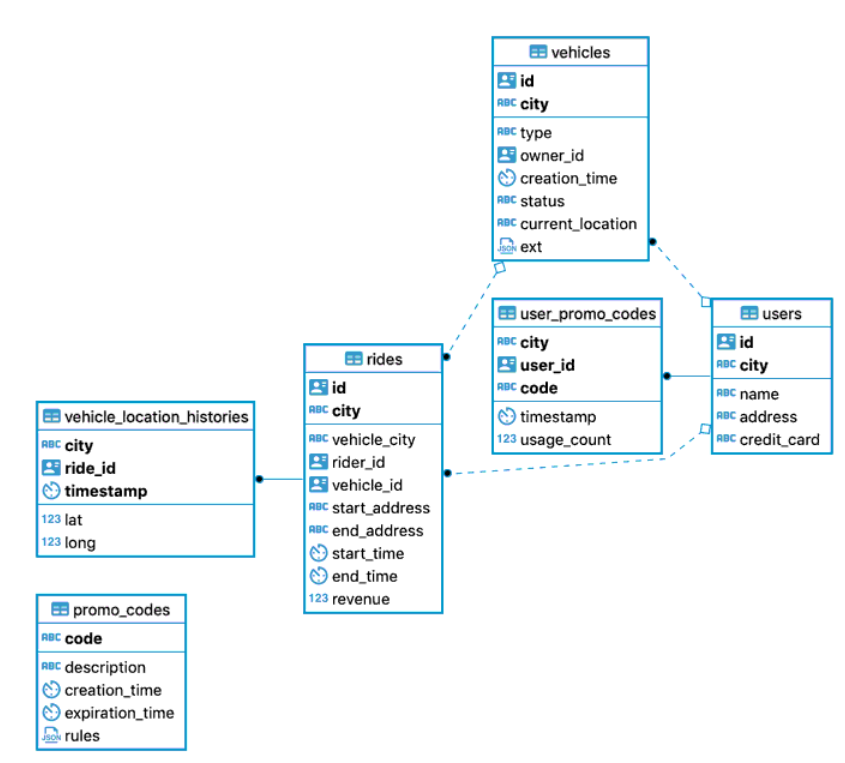

Images
======

There are two possible directives for images: the image directive and the figure directive.
Refer to `DocUtils <https://docutils.sourceforge.io/docs/ref/rst/directives.html#images>`_ for more options.

Image directive
---------------

.. code-block:: none

  .. image:: images/checkmark.png
      :alt: checkmark

Renders the image:

Figure directive
----------------

The figure directive allows you to use captions.

.. code-block:: none

   .. figure:: images/checkmark.png
      :alt: checkmark

      This is the caption for the image

Renders the image as:

   This is the caption for the image

Resize images
-------------

You can resize images (and figures) with the option ``width``.
When a reader clicks on an image with this option set, the image opens in a popup in full size.
This is handy when images are too small to be read from the documentation page.

For example:

.. code-block:: none

   .. figure:: images/diagram.svg
      :width: 150px

   .. image:: images/checkmark.png
      :width: 150px

Renders the image as:

Click on the image to preview it in full size.

Diagrams with metadata
----------------------

Use the ``diagram`` directive to wrap a figure or image with metadata so external tools can filter and extract diagrams.
The ``:id:`` option becomes the wrapper's HTML ``id`` attribute.
The remaining options are exposed as ``data-*`` attributes on the wrapping ``
``.

.. code-block:: none

   .. diagram::
      :id: auth-flow
      :tags: networking, security
      :categories: security
      :deployment: core
      :last-reviewed: 2026-06-01

      .. figure:: images/diagram.svg
         :alt: Authentication flow

         Authentication flow diagram.

Renders as:

.. diagram::
   :id: auth-flow
   :tags: networking, security
   :categories: security
   :deployment: core
   :last-reviewed: 2026-06-01

   .. figure:: images/diagram.svg
      :alt: Authentication flow

      Authentication flow diagram.
