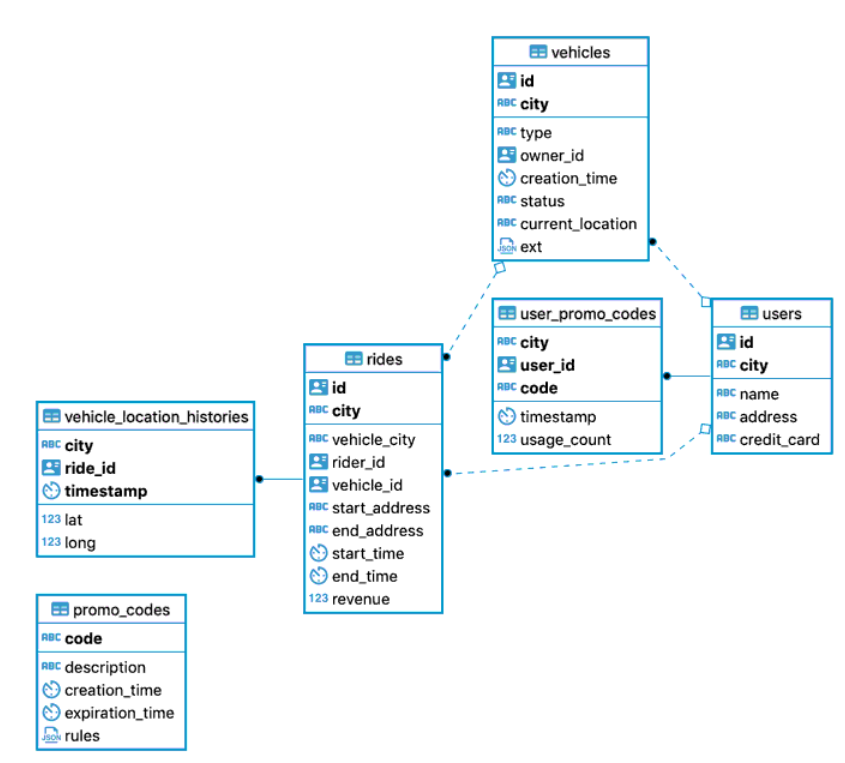

Images
======

There are two possible directives for images. One is the image directive and the other is the figure directive.
Refer to `DocUtils <https://docutils.sourceforge.io/docs/ref/rst/directives.html#images>`_ for more options.

.. code-block:: none

  .. image:: checkmark.png
      :alt: checkmark

renders the image

.. image:: checkmark.png
   :alt: checkmark

Whereas the Figure directive allows you to use captions

.. code-block:: none

   .. figure:: checkmark.png
      :alt: checkmark

   This is the caption for the image

Renders the image as:

.. figure:: checkmark.png
   :alt: checkmark

   This is the caption for the image

The custom class ``enlarge-image`` adds a button with the caption "Enlarge" on the top-right side corner of your images. 
When the user clicks on it, it opens a popup with the image in full width. 
This is handy when images are too small to be readable on the documentation page.

.. code-block:: none

   .. figure:: diagram.svg
      :width: 150px
      :class: enlarge-image

Renders the image as:

