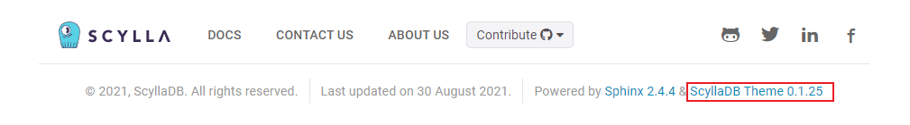

Migrating from 1.0 to 1.1
=========================

This guide explains how to upgrade the version of the Scylla Sphinx Theme.

How to check your current theme version
---------------------------------------

The theme version is displayed in the footer of the project's documentation site.

If your project theme's version is **>=1.0**, follow this guide to get the latest version.

Upgrade to version 1.1
----------------------

Here are the main breaking changes between the 1.0 and 1.1 versions.

#. Install `Poetry 1.12 <https://python-poetry.org/docs/master/>`_ or later on your computer.

#. Update the following Python dependencies in ``docs/pyproject.toml``:

    .. code-block::

        [tool.poetry.dependencies]
        python = "^3.7"
        pyyaml = "^6.0"
        pygments = "^2.11.2"
        recommonmark = "^0.7.1"
        sphinx-scylladb-theme = "~1.1.0"
        sphinx-sitemap = "^2.1.0"
        sphinx-autobuild = "^2021.3.14"
        Sphinx = "^4.3.2"
        sphinx-multiversion-scylla = "~0.2.10"

#. In ``conf.py``, remove the option ``"hide_sidebar_index": "true"`` (if exists).

	.. note:: Depending on your project configuration, you may find ``conf.py`` under ``docs/source/conf.py`` or ``docs/conf.py``.

#. Edit ``docs/Makefile``:

	#. Replace:

            .. code-block::

                POETRY = $(HOME)/.poetry/bin/poetry

            With:

            .. code-block::

                POETRY = $(HOME)/.local/bin/poetry

	#. Replace:

            .. code-block::

                .PHONY: setup
                setup:
                    ./_utils/setup.sh

            With:

            .. code-block::

                .PHONY: setup
                setup:
                    $(POETRY) install
                    $(POETRY) update

#. Remove the file ``docs/_utils/setup.sh``.

#. Remove the files ``.github/workflows/docs-*.yml``. Then, copy the new workflows in the ``.github/workflows`` folder. You can download the latest workflows `here <https://github.com/scylladb/sphinx-scylladb-theme/tree/master/.github/workflows>`_.

    If the default branch is not ``master`` or the docs are not under the ``docs`` folder, the workflows to match the project configuration. For example:

    .. code-block::

        on:
        push:
            branches:
            - master # edit this line
            paths:
            - "docs/**" # edit this line

#. Commit and push the changes to GitHub (default branch).

To check if the upgrade completed successfully, run the command :doc:`make preview <../../commands>`.
Then, check if the site footer displays version 1.1 or greater.

Optional features
-----------------

Changes in custom landing pages
...............................

If you were using the :ref:`Custom landing page feature <new_landing_page>`:

#. Add the following lines at the top of the file ``docs/source/index.rst``:

    .. code-block:: restructuredText

        :full-width:
        :hide-version-warning:
        :hide-pre-content:
        :hide-post-content:
        :landing:

#. Remove the lines:

    .. code-block:: restructuredText

        .. raw:: html

        

    .. note:: Remember to delete its closing ``
`` tag.  Here is the complete `diff <https://github.com/scylladb/sphinx-scylladb-theme/commit/2731e75c2c38625b9980d4371a64dd49e986fe1e#diff-4eec6cec5f6fab1548b85433ea8ca81315ae165db4b7f84019f287df9015699f>`_.
