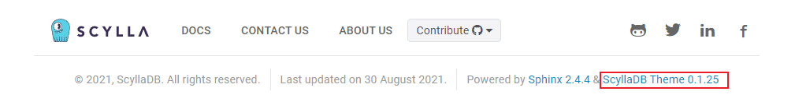

Migrating from 1.7 to 1.8
=========================

This guide explains how to upgrade the version of the ScyllaDB Sphinx Theme.

How to check your current theme version
---------------------------------------

The theme version is displayed in the footer of the project's documentation site.

If your project theme's version is **>=1.7**, follow this guide to get the latest version.

Upgrade to version 1.8
----------------------

We recommend that teams commit the ``poetry.lock`` file to the repository. 
Doing so ensures that dependencies are locked, leading to consistent documentation builds across different environments.
For more information, see `Committing your poetry.lock file to version control <https://python-poetry.org/docs/basic-usage/#committing-your-poetrylock-file-to-version-control>`_.

Steps to apply this change:

1. Remove the ``poetry.lock`` file from the ``.gitignore`` file. This file could be either in the root of the repository or in the ``docs`` directory.

2. Update the ``docs/Makefile`` and remove the ``rm -f poetry.lock`` command from the ``clean`` command:

.. code-block::

    # Clean commands
    .PHONY: clean
    clean:
        rm -rf $(BUILDDIR)/*
        # rm -f poetry.lock

3. Set all the dependencies to install the latest minor version in your ``docs/pyproject.toml`` file. 
   Each dependency under ``tool.poetry.dependencies`` should have the ``^`` symbol followed by the major and minor version. This will allow Poetry to install the latest minor version of the dependency.

    Example:

    .. code-block::

        [tool.poetry]
        name = "sphinx-docs"
        description = "ScyllaDB Documentation"
        version = "0.1.0"
        authors = ["ScyllaDB Documentation Contributors"]

        [tool.poetry.dependencies]
        python = "^3.10"
        pygments = "^2.18.0"
        sphinx-scylladb-theme = "^1.6.1"
        myst-parser = "^3.0.1"
        sphinx-autobuild = "^2024.4.16"
        Sphinx = "^7.3.7"
        sphinx-multiversion-scylla = "^0.3.1"
        sphinx-sitemap = "^2.6.0"
        redirects_cli ="^0.1.3"

        [build-system]
        requires = ["poetry>=0.12"]
        build-backend = "poetry.masonry.api"

4. Add the following ``dependabot.yml`` configuration file in the ``.github`` directory:

    .. literalinclude:: _partials/dependabot_template.yml

   This configuration helps keep your project up-to-date with the latest theme versions automatically.

5. Commit the changes to the repository, including the ``poetry.lock`` file.