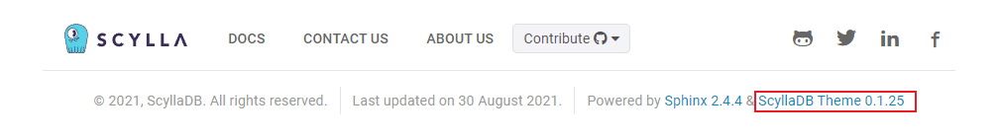

Upgrading from 1.8 to 1.9
=========================

This guide explains how to upgrade the version of the ScyllaDB Sphinx Theme from 1.8 to 1.9.

How to check your current theme version
---------------------------------------

The theme version is displayed in the footer of the project's documentation site.

If your project theme's version is **>=1.8**, follow this guide to get the latest version.

What's new in 1.9
------------------

- **Python 3.11+**: Python 3.10 is no longer supported. Python 3.11 or later is required.
- **Sphinx 9**: The documentation toolchain now targets Sphinx 9.x.
- **uv replaces Poetry**: The package manager has migrated from `Poetry <https://python-poetry.org/>`_ to `uv <https://docs.astral.sh/uv/>`_ for faster and more reliable dependency management.
- **Node.js 22**: The frontend build now targets Node.js 22.

Upgrade to version 1.9
-----------------------

Migrate from Poetry to uv
..........................

The toolchain has replaced Poetry with uv. Follow these steps to migrate your project.

**Step 1: Install uv**

Install uv by following the `official installation guide <https://docs.astral.sh/uv/getting-started/installation/>`_:

.. code-block:: console

   curl -LsSf https://astral.sh/uv/install.sh | sh

**Step 2: Update docs/pyproject.toml**

Replace the contents of ``docs/pyproject.toml`` with the new PEP 621 format.

Old format (Poetry):

.. code-block::

    [tool.poetry]
    name = "sphinx-docs"
    description = "ScyllaDB Documentation"
    version = "0.1.0"
    authors = ["ScyllaDB Documentation Contributors"]
    package-mode = false

    [tool.poetry.dependencies]
    python = "^3.10"
    pygments = "^2.18.0"
    sphinx-scylladb-theme = "^1.8.1"
    myst-parser = "^3.0.1"
    sphinx-autobuild = "^2024.4.19"
    Sphinx = "^7.3.7"
    sphinx-multiversion-scylla = "^0.3.15"
    sphinx-sitemap = "^2.6.0"
    redirects_cli ="^0.1.3"

    [build-system]
    requires = ["poetry>=1.8.0"]
    build-backend = "poetry.masonry.api"

New format (uv / PEP 621):

.. code-block::

    [project]
    name = "sphinx-docs"
    description = "ScyllaDB Documentation"
    version = "0.1.0"
    requires-python = ">=3.12"
    dependencies = [
        "pygments>=2.18.0",
        "sphinx-scylladb-theme>=1.9.0",
        "myst-parser>=5.0.1",
        "sphinx-autobuild>=2025.08.25",
        "sphinx>=9.0",
        "sphinx-multiversion-scylla>=0.3.5",
        "sphinx-sitemap>=2.9.0",
        "redirects_cli>=0.1.3",
    ]

    [tool.uv]
    package = false

**Step 3: Delete poetry.lock and generate uv.lock**

Remove the old Poetry lockfile and generate a new one with uv:

.. code-block:: console

   rm -f docs/poetry.lock
   cd docs && uv lock

**Step 4: Update .github/dependabot.yml**

Replace the Dependabot configuration with the new uv ecosystem:

Old format:

.. code-block::

    version: 2
    updates:
      - package-ecosystem: "pip"
        directory: "/docs"
        schedule:
          interval: "daily"
        allow:
          - dependency-name: "sphinx-scylladb-theme"
          - dependency-name: "sphinx-multiversion-scylla"

New format:

.. literalinclude:: _partials/dependabot_template.yml

**Step 5: Update docs/Makefile**

Replace the Poetry-based Makefile with the uv equivalent.

Old Makefile header:

.. code-block::

    POETRY        = poetry
    SPHINXBUILD   = $(POETRY) run sphinx-build

    .PHONY: setupenv
    setupenv:
        pip install -q poetry

    .PHONY: setup
    setup:
        $(POETRY) install

    .PHONY: update
    update:
        $(POETRY) update

New Makefile header:

.. code-block::

    UV            = uv
    SPHINXBUILD   = $(UV) run sphinx-build

    .PHONY: setupenv
    setupenv:
        pip install -q uv

    .PHONY: setup
    setup:
        $(UV) sync

    .PHONY: update
    update:
        $(UV) sync --upgrade

Replace all remaining ``$(POETRY) run`` references with ``$(UV) run``.

**Step 6: Update .gitignore**

If your ``.gitignore`` excludes ``poetry.lock``, remove that entry and commit ``uv.lock`` instead:

.. code-block:: console

   # Remove from .gitignore:
   # poetry.lock

Commit ``docs/uv.lock`` to version control to ensure reproducible builds.

**Step 7: Preview the docs**

Verify the docs build without errors:

.. code-block:: console

    cd docs
    make preview

Upgrade Python to 3.11 or later
................................

Python 3.10 is no longer supported. Python 3.11 or later is required.

Check your Python version:

.. code-block:: console

    python --version

If you need to upgrade, download the latest version from `python.org <https://www.python.org/downloads/>`_ or use `pyenv <https://github.com/pyenv/pyenv>`_:

.. code-block:: console

    pyenv install 3.12
    pyenv global 3.12

Update GitHub Actions workflows
...............................

Update all GitHub Actions workflows that reference Python 3.10:

#. Replace ``python-version: '3.10'`` with ``python-version: '3.12'``.

#. Add the uv setup step before any Python commands:

   .. code-block:: yaml

       - name: Install uv
         uses: astral-sh/setup-uv@v6

#. Replace Poetry commands:

   - ``pip install -q poetry`` → ``pip install -q uv``
   - ``poetry install`` → ``uv sync``
   - ``poetry run <cmd>`` → ``uv run <cmd>``

Upgrade Node.js to 22
.....................

If your project builds frontend assets, upgrade to Node.js 22.

Check your Node.js version:

.. code-block:: console

    node --version

Use `nvm <https://github.com/nvm-sh/nvm>`_ to switch versions:

.. code-block:: console

    nvm install 22
    nvm use 22

Add a ``.nvmrc`` file to the root of your repository to pin the version:

.. code-block:: console

    echo "22" > .nvmrc
