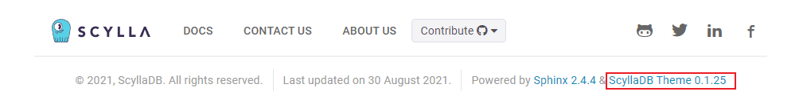

Upgrading from 1.9 to 1.10
==========================

This guide explains how to upgrade the version of the ScyllaDB Sphinx Theme
from 1.9 to 1.10.

How to check your current theme version
---------------------------------------

The theme version is displayed in the footer of the project's documentation site.

If your project theme's version is **>=1.9**, follow this guide to get the
latest version.

What's new in 1.10
------------------

See the :doc:`CHANGELOG <CHANGELOG>` for the full list of changes in this
release.

Upgrade to version 1.10
-----------------------

Enable the redirect validator on pull requests
..............................................

1. Add a ``check-redirects`` **target to** ``docs/Makefile``.
    It checks every ``/stable/`` redirect target is reachable on the live site:

.. code-block:: makefile

    .PHONY: check-redirects
    check-redirects: setup
        $(UV) run scylla-check-redirects --yaml _utils/redirects.yaml --conf $(SOURCEDIR)

2. Add a step to** ``.github/workflows/docs-pr.yaml`` before the docs build so bad redirects fail fast:

.. code-block:: yaml

    - name: Check redirects
      run: make -C docs check-redirects
