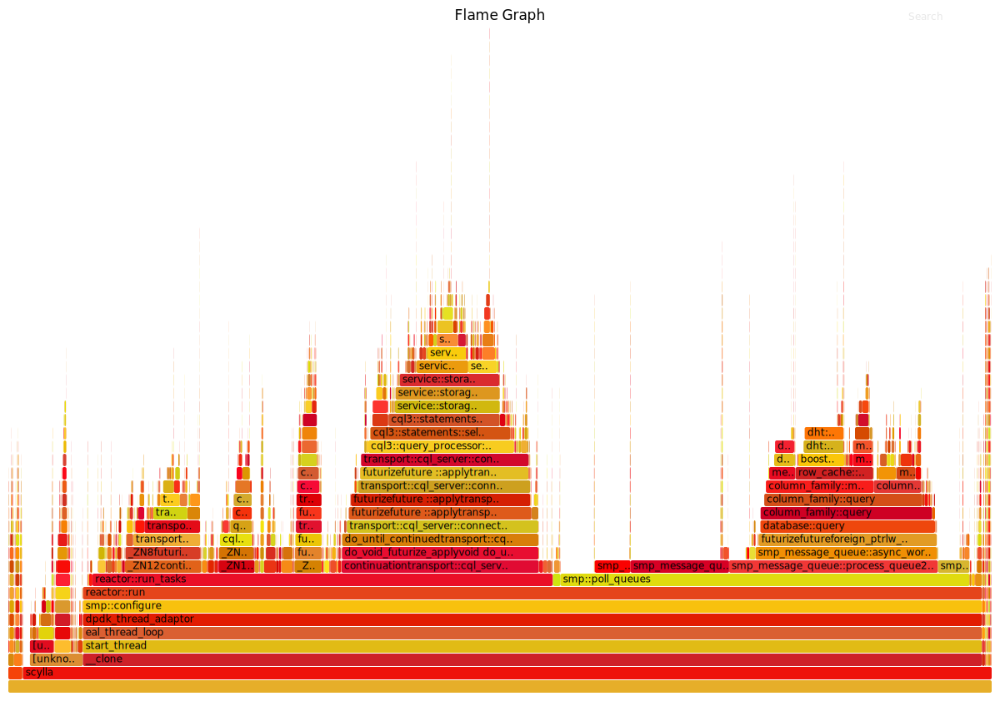

=====================================
Debug your database with Flame Graphs
=====================================

Flame Graphs are used as a debugging tool to identify latency and the part of the execution path that takes most of the CPU time. 
Use Flame Graphs when you:

* Need to understand which Scylla code path/functions are using the most time. For instance, when you have latency issues.
* Need to compare time spent in particular Scylla code paths/functions on different shards. For instance, when you have latency issues on one CPU but not on the other.

Run a Flame Graph
-----------------

**Procedure**

1. Clone the repoistory
 
.. code-block:: none

   git clone https://github.com/brendangregg/FlameGraph

2. Change into the directory where the flamegraph packages are located.

.. code-block:: shell

   cd FlameGraph

3. Run the following perf commands, using `Map CPU to Scylla Shards </kb/map-cpu/>`_  and `Using the perf utility with Scylla </kb/use-perf/>`_ for reference.

.. code-block:: shell

   sudo perf record --call-graph dwarf -C <CPU on which you are onrecording>
   sudo perf script | `pwd`/stackcollapse-perf.pl | `pwd`/flamegraph.pl > some_name.svg

4. The result is an .svg file that is not just a picture but a dynamic diagram where you can search, zoom in, and zoom out. In order to enjoy a Flame Graph properly with all of its features you can open it in a browser such as Chrome or Firefox. 

Tips
----

* On the CPU you are recording, try to load Scylla to consume 100% of the CPU runtime. Otherwise you’ll see a lot of OS functions related to the idle time handling

* Recording on all shards (e.g. using “perf record” -p parameter) may lead to confusing results recording the same symbol called from different threads (shards). This is not recommended.

