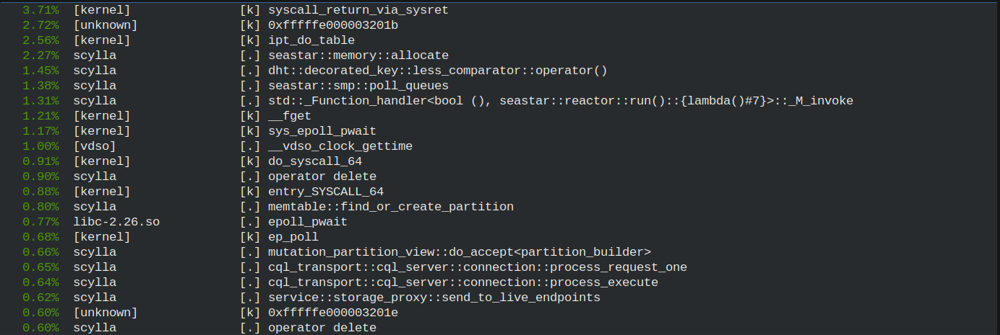

==================================
Using the perf utility with Scylla
==================================

This article contains a list of useful tips & tricks for using the `perf` utility with Scylla.

Due to its thread-per-core nature, looking at aggregates is rarely useful as it tends to hide bad behavior that is localized to specific CPUs. Looking at an individual CPUs will make those anomalies easier to see. Once you identify that a Scylla shard is behaving in a way that merits investigation (for example, by noticing through the Scylla Monitor shard view on a specific node that a particular shard is more loaded than others), you can use the ``seastar-cpu-map.sh`` script described `here </kb/map-cpu/>`_  to identify which Linux CPU hosts the Scylla shard in question. For example:

.. code-block:: bash

   seastar-cpu-map.sh -n scylla -s 0

   shard: 0, cpu: 1

In this example we want to investigate shard 0, using the -s argument and citing the shard number. The results show that shard 0 runs on Linux CPU 1. In all perf commands that follow you can add the ``-C 1`` argument to restrict ``perf`` to look only at CPU 1.

When is perf useful?
--------------------

Perf is most useful when the CPU being probed runs at 100% utilization, so we can identify large chunks of execution time used by particular functions.

Note that due to polling, Scylla will easily drive CPUs to 100% even when it is not bottlenecked. It will spin (poll) for some time waiting for new requests. This tends to show in the perf reports as functions related to polling having high CPU time.

Perf can also be a useful tool when we suspect that something that shouldn’t be running, is running. One example is systems with very high ``reactor_utilization`` (indicating non-polling work), where the Linux view of ``system`` CPU utilization is also high. This indicates that the Linux Kernel, and not Scylla, is the main user of CPU, so additional investigation is needed.

perf top
--------

Perf top shows a point-in-time view of the system. The figure below is a result of running ``perf top -C 1``

Callgraphs
----------

Perf can generate callgraphs as well. They are useful when we want to understand the complete call chain that results in a function being called. We can add  ``--call-graph=dwarf  -F 99`` to any recording command, like ``perf top`` or ``perf record`` to generate a callgraph.

For example, to record the callgraphs in CPU2:

.. code-block:: bash
   
   sudo perf record -C 2 --call-graph=dwarf  -F 99

We can dump the results to  to a text file named ``trace.txt``, by running:

.. code-block:: bash

   sudo perf report  --no-children --stdio > /tmp/trace.txt

