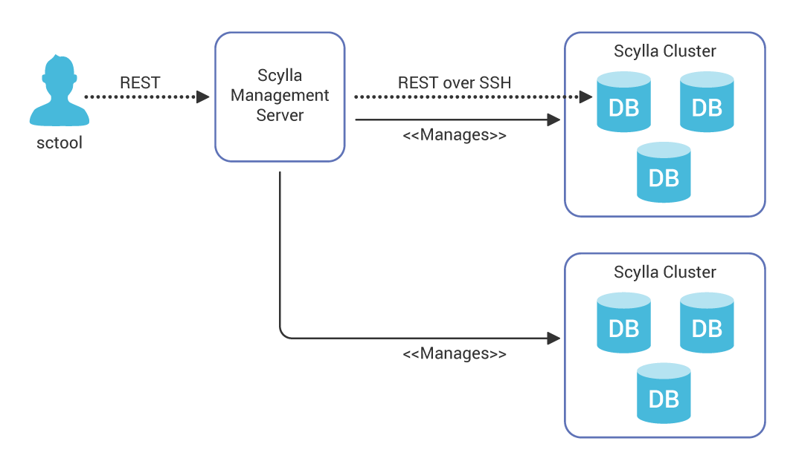

Scylla Manager
==============

.. versionadded:: 1.1 Scylla Manager

.. contents:: 
    :depth: 1
    :local:

Overview
--------

Scylla Manager is a centralized cluster administration and recurrent tasks automation tool.

.. note::
																                                                              
   Scylla Manager is a component of Scylla Enterprise. Click `here <https://www.scylladb.com/product/scylla-enterprise/>`_ to learn about becoming a Scylla Enterprise customer.

Scylla Manager 1.x includes automation of periodic repair, with future releases providing more capabilities, such as rolling upgrades, recurrent backup, and more. With time, Scylla Manager will become the focal point of Scylla Enterprise Cluster Management, including a GUI frontend.

Scylla Manager includes three main parts:

* Scylla-Manager, a Go-based server(daemon) that exposes REST API
* sctool, a CLI tool for interacting with Scylla-Manager
* A highly available backend to persist its state

The Scylla-Manager server interacts securely with one or more Scylla clusters, learns its topology, and runs cluster-wide tasks in a controlled and predictable way.
A user can use **sctool** to initiate and schedule management operations, monitor their progress or suspend them.
For the best high availability, Scylla Manager uses ScyllaDB as a persistent backend. By default, Scylla Manager installs one local instance of Scylla as backend. For a highly available management solution, we recommend using a multi-node Scylla cluster as a backend. The Scylla Manager server is stateless and relies on Scylla backend for persistence.

Although possible, we do not recommend using the managed Scylla cluster to store as Scylla Manager backend.

Recurrent Repairs Automation
----------------------------
It is highly recommended to run weekly repairs on production Scylla clusters but repairing a full cluster is not an easy task and multiple strategies exist. Scylla manager provides a dedicated solution that leverages Scylla's thread-per-core architecture for best results. Clusters are repaired node by node, ensuring that each database shard performs exactly one repair task at a time. This gives the best repair parallelism on a node, shortens the overall repair time, and does not introduce unnecessary load. On a shard level, a repair is performed in chunks and can be stopped and resumed.

Working with Scylla Manager: Terms
----------------------------------

Basic terms used by **sctool** to interact with Scylla Manager:

* **Cluster** - A Scylla Cluster managed by Scylla Manager and a Scylla Manager can manage multiple clusters. One can add and remove managed clusters at runtime using **sctool**.
* **Task** - A management task, that can be scheduled, started, and stopped by the manager on a particular cluster. There is currently two type of tasks:
  
  1. **repair** - A type of **Task** which executes a cluster-wide repair of a keyspace where each table repair is defined as a **Unit**.
  2. **repair_auto_schedule** - A type of **Task** which runs by default every week, reads all the tables from the cluster and creates **repair** for each. **repair_auto_schedule** is automatically added when a new cluster is added to Scylla Manager to manage.
     
* **Repair Unit** - One execution unit, for example, repair of a particular keyspace. Multiple units can be part of one **Task**.
* **Repair Segment** - Each repair unit is internally executed one segment at a time, where each segment is a token range.

Scylla Manager in Action
------------------------
The following example, **sctool** is used to:

* Managed a new Scylla cluster from Scylla Manager using ``sctool cluster add ...``. This automatically adds all existing keyspace to a repair scheduled
* List managed cluster with ``sctool cluster list``
* List the repair units with ``sctool repair unit list`` unit list
* List scheduled tasks with ``sctool task list``
* Add a new repair task with ``sctool repair schedule important_data``
* Monitor the repair progress with ``sctool repair progress``
* Stop and Start an ongoing repair task with ``sctool task stop`` and ``sctool task start``

.. raw:: html

   

         

         
         

   
           

.. comments
   TBD: add links to sctool reference and manager install

