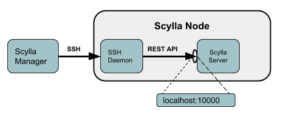
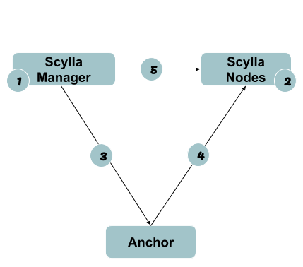

====================
Scylla Manager Setup
====================

.. versionadded:: 1.1 Scylla Manager

Scylla Manager is a centralized Scylla cluster administration and recurrent tasks automation element.
The following document walks you through the Scylla Manager setup phase, assuming you completed the manager installation.

.. contents:: 
   :depth: 2
   :local:

**Before you begin**

Verify that you have already read and followed the installation procedure and that your system meets the requirements described `here <https://www.scylladb.com/enterprise-download/#manager>`_. If you want to set up Scylla Manager with a remote backend. 

Setup script
============
The Scylla Manager script is a wizard which automates some of the basic configuraiton for the Scylla Manager service. 

**Procedure**

1. Run the scyllamgr_setup script to configure the service

.. code-block:: shell

   sudo scyllamgr_setup

2. The wizard contains one question about enabling ScyllaDB management services. Enabling the managment services allows the Scylla Manager to start automatically, each time the Scylla nodes boot.  If you answer no to this question, you will have to start Scylla Manager manually each time  you want to use it. 

.. code-block:: shell
   
   Do you want to enable ScyllaDB management services?
     
   Answer yes to automatically start Scylla and Scylla Manager when the node boots; answer no to skip this step.[YES/no]

If you answer yes, the setup script creates symbolic links to automate the Managment services. 

**Note**
Scylla Manager will not run without creating an SSH key (see `SSH Comunication`_ ). This key can be disabled, but it is not recommended to do so. 

SSH Comunication
================

By default, Scylla Manager uses SSH to securely access the Scylla nodes. It is possible to connect to each node seperately without using SSH (by updating the .yaml files for both Scylla and Scylla Manager), but it is not best practice to do so. SSH communication must be established between Scylla Manager and the Scylla nodes before adding the cluster to Scylla Manager. 

.. comments
   Add link to Manager install

SSH connectivity workflow
-------------------------

There are several steps which need to be followed to ensure that Scylla Manager can connect to its nodes over SSH.

**Workflow**

1. `Prepare SSH Keys`_
2. `Create a scylla-manager user on all Scylla Nodes`_ 
3. `Distibute the SSH key to each Scylla node`_ - If you used your own key and you have distributed it to your cluster, you may skip this step.
4. `Validate that Scylla Manager is connected to the cluster`_

Prepare SSH Keys
================
You may either `Use your own SSH key`_, or `Generate a new SSH key pair`_. 

Generate a new SSH key pair
---------------------------

This procedure generates a new key and changes the owner of the keyfile to the scylla-manager user.

**Procedure**

1. On the machine running Scylla Manager, generate the SSH Key.

.. code-block:: shell
                
   sudo ssh-keygen -t rsa -b 2048 -N "" -f /var/lib/scylla-manager/scylla_manager.pem

2. Change the permission setting of the keyfile to read only by the owner and not permitted to anyone else, so that it will not be overwritten.

.. code-block:: shell

   sudo chmod 0400 /var/lib/scylla-manager/scylla_manager.pem

3. Change the owner of the keyfile to scylla-manager user within the scylla-manager group

.. code-block:: shell

   sudo chown scylla-manager:scylla-manager /var/lib/scylla-manager/scylla_manager.pem

4. Verify that the changes were made. The owner of the file should be scylla-manager, and the file should be read only by the owner and not permitted by anyone else.

In this example, the file is owned by the scylla-manager user who is also a member of the scylla-manager group. 

.. code-block:: shell

   sudo ls -l /var/lib/scylla-manager/scylla_manager.pem
   -r--------. 1 scylla-manager scylla-manager 1675 Jan 21 13:07 /var/lib/scylla-manager/scylla_manager.pem

5. Run Scylla Manager service (if not already running)

.. code-block:: shell

   sudo systemctl start scylla-manager

6. Verify the Scylla Manager service is running by displaying the sctool version. If there is a connection issue to either the client or the server an error message will display. 

.. code-block:: shell

    > sctool version
    Client version: 1.0.0_0.20180119.49f4a33
    Server version: 1.0.0_0.20180119.49f4a33

Use your own SSH key
--------------------

You can use your own SSH key. It is required that you have access to the cluster from Scylla Manager. 

**Procedure**

1. Do one of the following:
   
   * Copy and rename your SSH key to ``/var/lib/scylla-manager/scylla_manager.pem``

   **-OR-**

   * Use your SSH key from its current location and update the ``/etc/scylla-manager/scylla-manager.yaml`` file.
     Using an editor, edit the “SSH” section as follows:
        
     * ``identity_file``  - change to the location of your SSH private key
     * ``user``  - change to a user with access to the Scylla nodes.

     In this example, the scylla-manager.yaml file has been edited so that the user name is ``scylla-manager`` and the location of the private key file is ``/var/lib/scylla-manager/scylla_manager.pem``:

     .. code-block:: shell

        $ vim /etc/scylla-manager/scylla-manager.yaml

        # SSH is used to access scylla nodes. User private key must be PEM encoded and
        # stored in the location specified in the identity_file parameter.
  
        ssh:
        user: scylla-manager
        identity_file: /var/lib/scylla-manager/scylla_manager.pem

2. Make sure the user ``scylla-manager`` is the owner of the .pem file (either your key file or the scylla_manager.pem file you just moved) and the file permissions are 0400 (meaning that it is read-only).

In this example, the key file scylla_manager.pem, owned by scylla-manager user who is also a member of the scylla-manager group. The private key file is read-only.

.. code-block:: shell

   sudo ls -l /var/lib/scylla-manager/scylla_manager.pem
   -r--------. 1 scylla-manager scylla-manager 1675 Jan 21 13:07 /var/lib/scylla-manager/scylla_manager.pem

3. Run Scylla Manager service (if not already running).

.. code-block:: shell

   sudo systemctl start scylla-manager

4. Verify the Scylla Manager service is running by displaying the sctool version. If there is a connection issue to either the client or the server an error message displays. 

.. code-block:: shell

   > sctool version -c scylla-manager
   Client version: 1.0.0_0.20180119.49f4a33
   Server version: 1.0.0_0.20180119.49f4a33

Create a scylla-manager user on all Scylla Nodes
================================================

When the Scylla Manager communicates with the Scylla nodes, it establishes an SSH connection using the username scylla-manager. If this username is unknown on the nodes, the connection will fail.

**Procedure**

1. On every Scylla node you want to connect to Scylla Manager, run the following command:

.. code-block:: shell

   sudo useradd scylla-manager

2. Repeat step 1, until all Sylla nodes have the scylla-manager user in their User Manager file. 

Distibute the SSH key to each Scylla node
=========================================
If you used your own key (`Use your own SSH key`_) and it’s already distributed on the Scylla cluster, you can skip this section and continue with `Adding an existing Scylla cluster`_.

This step distributes the public key we generated earlier to all of the Sylla nodes you wish to connect to via SSH. The process uses a third machine called an anchor and includes the following steps:

**Legend**

1. Generate an SSH keypair (private/public) on Scylla Manager ( This was done with -`Prepare SSH Keys`_)
2. Create a scylla-manager user on all nodes (This was done with - `Create a scylla-manager user on all Scylla Nodes`_ )
3. `Copy the public key to the Anchor machine`_
4. `Upload the Manager public key to each Sylla node`_ from the Anchor to the nodes
5. `Verify the SSH connection`_ with the nodes using the scylla-manager user

Before you begin this procedure, it is assumed you already did the first two steps of the workflow described in the diagram above. The sections that follow, walk you through the last three steps. 

Copy the public key to the Anchor machine
-----------------------------------------
Copy the public keyfile to a machine that can access the Scylla nodes. In this example, that machine is called "Anchor".

**Procedure**

1. From the Scylla Manager, copy the public keyfile: ``scylla_manager.pem.pub`` to a temporary directory:

.. code-block:: shell

   sudo cp /var/lib/scylla-manager/scylla_manager.pem.pub /tmp

2. From the Anchor machine, download the key file. Where ``SCYLLA-MANAGER-HOST``, is Scylla Manager's IP address. 

.. code-block:: shell

   scp centos@SCYLLA-MANAGER-HOST:/tmp/scylla_manager.pem.pub .

Upload the Manager public key to each Sylla node
------------------------------------------------

Upload the Manager public key to each Scylla node from the Anchor machine.

**Procedure**

1. From the Anchor machine, given that you have SSH access to a sudo enabled user USER on an each Scylla node HOST, create an SSH_CMD variable as follows:

.. code-block:: shell

   SSH_CMD='ssh USER@HOST'

For example with AWS:

.. code-block:: shell

   SSH_CMD='ssh centos@ec2-18-217-79-221.us-east-2.compute.amazonaws.com'

2. While still on the anchor machine, install the public key on each Scylla node:

.. code-block:: shell

   cat scylla_manager.pem.pub | ${SSH_CMD} 'sudo -u scylla-manager sh -c "cd && mkdir -p ~/.ssh && cat > ~/.ssh/authorized_keys"'

3. Repeat this procedure for all Scylla nodes. 

Verify the SSH connection
-------------------------
Verify you can connect to the nodes from Scylla Manager.

**Procedure**

1. From Scylla Manager, test connectivity to a Scylla node by sending it a command to return the username of user listed in the private key file on the node. Replace `HOST` with the IP address of the Scylla Node:

.. code-block:: shell
                
   sudo -H -u scylla-manager bash -c 'ssh -i /var/lib/scylla-manager/scylla_manager.pem scylla-manager@HOST whoami'

   scylla-manager

This command should works on any Scylla node in the cluster. 

Adding an existing Scylla cluster
=================================

Once you have established SSH connectivity from Scylla Manager to the Scylla nodes, add the cluster to Scylla Manager.

**Procedure**

1. To optimize and parallelize repair operations, Scylla Manager needs to use the number of shards (cores) used by the Scylla nodes. To find out the number of shards currently being used, run the following command from a Scylla node:

.. code-block:: shell

   scyllatop -l | grep gauge-utilization | wc -l

2. From Scylla Manager, add the new cluster

.. code-block:: shell
                
   sctool cluster add --hosts <scylla-nodes> -n <cluster-name> --shard-count <shard-count>
  
Where:

`scylla-nodes`
   is a subset of Scylla node IPs
`cluster-name`
   is a unique name you will use to manage the cluster
`shard-count`
   is the value you extracted from a Scylla node above

For more information on sctool and the cluster add command, refer to `sctool cluster add reference <../sctool/#cluster-add>`_.

Validate that Scylla Manager is connected to the cluster
========================================================

Verify that you can connect to the cluster from Scylla Manager.

**Procedure**

1. After adding a new cluster a repair unit is automatically created. Use the list command from the Scylla Manager to see which repair units were created. As this also requires Scylla Manager to communicate to the nodes, you are also checking that the SSH connection works. If this command fails, it means there is an connection issue or some configuration error. 
                
.. code-block:: shell

   sctool repair unit list -c <cluster-name>

