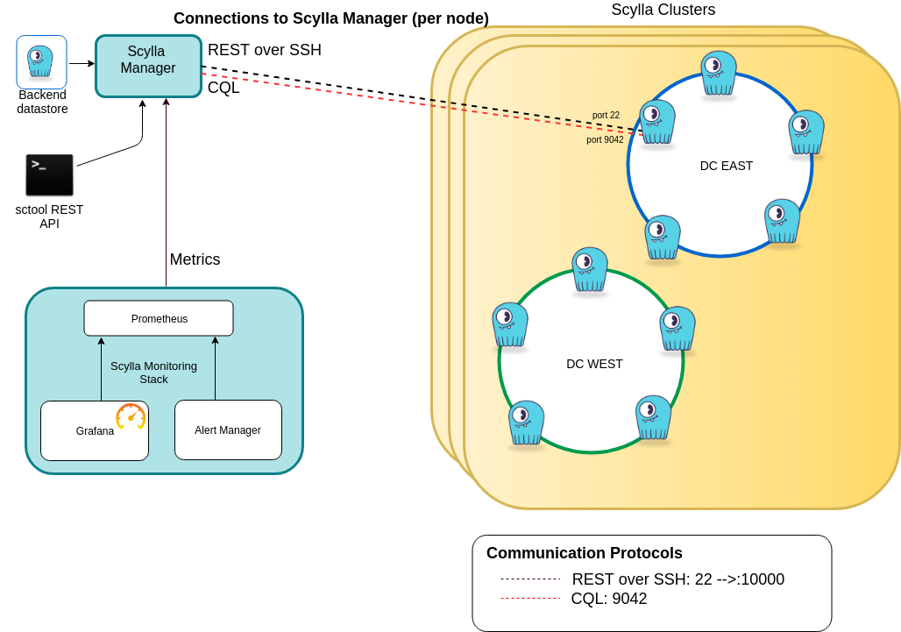

Overview
========

Scylla Manager is a product for database operations automation.
It can manage multiple Scylla clusters and run cluster-wide tasks in a controlled and predictable way.
Scylla Manager discovers cluster topology and is aware of nodes belonging to different datacenters.

No sidecar
----------

The concept of having a companion application installed together with another application is known as a sidecar.
Scylla Manager is designed so that there is no need for sidecar processes running on Scylla nodes.
Scylla Manager supports SSH tunnelling for its interactions with Scylla clusters.
While SSH communication with the cluster is not mandatory, it is recommended as it does not require any database configuration changes and only requires a dedicated user with minimal permissions.
Included in the Scylla Manager package is a script which sets up SSH connectivity to all nodes using one simple command.

Deployment
----------

Scylla Manager consists of two components:

* Server - daemon that exposes REST API
* Sctool - a command-line interface (CLI) for interacting with the server over the REST API

The server persists its data to a Scylla cluster.
It comes with a pre-installed single node cluster running locally but can be changed to an external cluster
(see `Use a remote database for Scylla Manager <../use-a-remote-db>`_ for details).

Optionally (but recommeneded) you can add Scylla Monitoring Stack to enable reporting of Scylla Manager metrics and alerts. 

The diagram below presents a logical view of Scylla Manager with a remote backend datastore managing multiple Scylla Clusters situated in datacenters.
For simplicity only one cluster is shown.
Each node has two connections with the Scylla Manager.
One is an SSH connection which is used for all Scylla Manager activities except for the `Scylla Health Check`_ which uses a CQL connection.

Integration with Scylla Monitoring Stack
----------------------------------------

The Scylla Monitoring Stack consists of three components, wrapped in Docker containers:

* prometheus - collects and stores metrics
* alertmanager - handles alerts
* grafana - dashboard server

When used with Scylla Manager, the metrics for all of your managed clusters and alerts can be viewed using Scylla Monitoring.
Progress for Repairs, node status and other metrics and Alerts including Scylla Manager status can be viewed using the Monitoring stack 2.0 Manager dashboard.
For more information, refer to the `Scylla Monitoring </operating-scylla/monitoring/>`_ documentation.

Scylla Health Check
-------------------

Scylla Manager automatically adds a health check task to all new nodes when the cluster is added to Scylla Manager and to all existing nodes during the upgrade procedure.
The health check task ensures that CQL native port is accessible on all the nodes.
For each node, in parallel, Scylla Manager opens a connection to a CQL port and asks for server options.
If there is no response or the response takes longer than 250 milliseconds, the node is considered to be `DOWN` otherwise the node is considered to be `UP`.
The results are available using the `sctool status <../sctool/#status>`_ command.

If you have enabled the Scylla Monitoring stack, Monitoring stack 2.0 Manager dashboard includes the same cluster status report.
A new Alert was defined in Prometheus Alert Manager, to report when a Scylla node health check fails and the node is considered `DOWN`.

Requirements
------------
Scylla Manager has modest systems requirements. While a minimal Manager server can run on a system with 2 cores, 1GB system, the following configuration is recommended:

* **CPU** - 2vCPUs
* **Memory** - 8GB+ DRAM

.. note::  If you are running `Scylla Monitoring Stack </operating-scylla/monitoring/monitoring_stack/>`_ on the same server as Scylla Manager, your system should also meet the minimal `Monitoring requirements </operating-scylla/monitoring/monitoring_stack/#minimal-production-system-recommendations>`_.

.. note:: Scylla Manager only works with Scylla clusters that are using the Murmur3 partitioner (Scylla default partitioner). To check your cluster's partitioner, run the cqlsh command ``DESCRIBE CLUSTER``.

See Also
--------

* `Setup Scylla Manager <../setup>`_
* `sctool Reference <../sctool>`_
